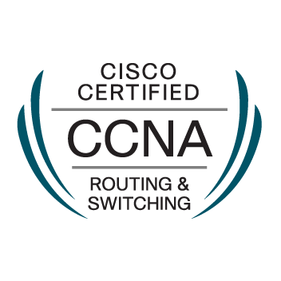
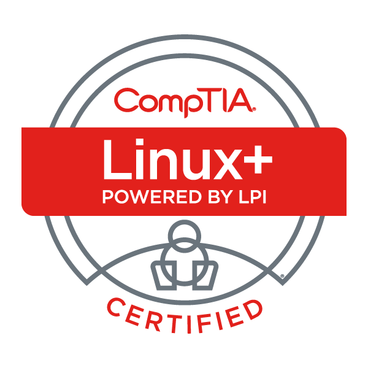
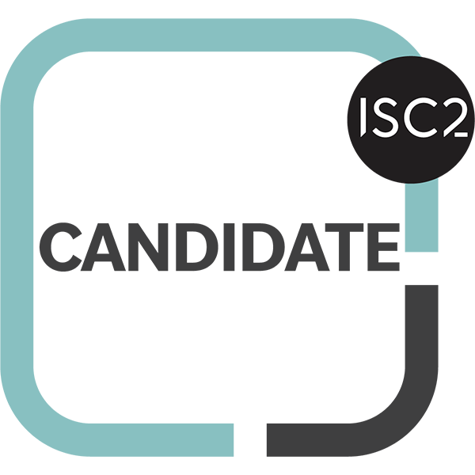
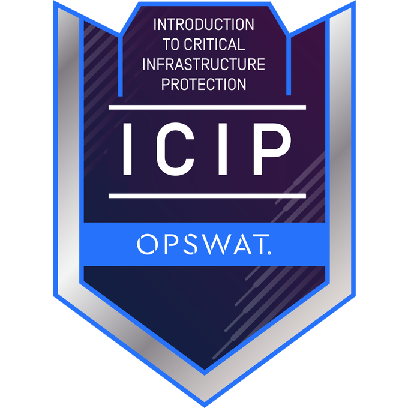
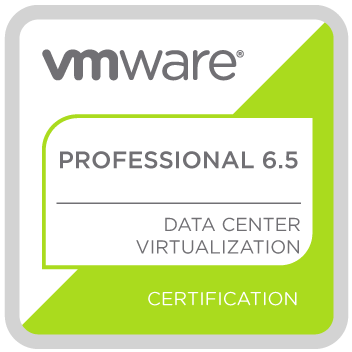

# 👋 Hi, I'm Dexter Pineda

> 🐧 Linux • ☁️ Cloud • ⚙️ DevOps • 🔐 Security • 🚀 Infrastructure Engineer

I design, build, and document real-world infrastructure using Linux, cloud platforms, and DevOps automation tools. My focus is on hands-on learning, production-style labs, and structured technical education.

---

## 🚀 About Me

- 🔧 Passionate about Linux systems and enterprise infrastructure
- ☁️ Working with AWS cloud environments and architecture
- ⚙️ Building DevOps automation using Terraform, Kubernetes, and Ansible
- 🔐 Interested in cybersecurity and secure system design
- 📚 Creating a structured Linux learning series: *Linux for Beginners*
- 🎥 Preparing technical tutorials and lab-based learning content

---

## 🧰 Tech Stack & Tools

### 💻 Operating Systems

---

### ☁️ Cloud & Infrastructure

---

### ⚙️ Automation & Scripting

---

### 🔐 Security & Networking

---

## 🎓 Certifications

### ☁️ Cloud Certifications

---

### 🐧 Linux & Open Source

---

### 🔐 Security Certifications

---

### 🌐 Networking & Virtualization

---

### 💻 Microsoft

---

---

## 🏅 Verified Credly Digital Badges

> Click on any badge to verify the certification on Credly.

---

## 📂 Featured Projects

### 🐧 Linux for Beginners
A structured Linux learning journey covering commands, filesystem, permissions, and system administration.

👉 https://github.com/dexterpineda/linux-for-beginners

---

### ☁️ Terraform AWS Labs
Hands-on Infrastructure-as-Code projects using AWS and Terraform.

---

### ⚙️ Kubernetes Homelab
Production-style Kubernetes cluster setup with real-world architecture and tooling.

---

## 📊 GitHub Stats

---

## 📈 Contribution Graph

---

## 🎯 Current Focus

- 🐧 Linux system administration mastery
- ☁️ AWS architecture & automation
- ⚙️ Infrastructure as Code (Terraform)
- ☸️ Kubernetes production deployments
- 🔐 Security-focused infrastructure design
- 📚 Building structured DevOps learning content

---

## 📚 Learning Philosophy

> “Real understanding comes from building, breaking, and fixing systems—not just reading about them.”

---

## 📬 Connect With Me

- GitHub: https://github.com/dexterpineda  
- YouTube: Coming Soon  
- Blog: Coming Soon  
- LinkedIn: Coming Soon  

---

## ⭐ Goals for 2026

- Publish complete Linux learning series
- Build full DevOps portfolio on GitHub
- Create production-grade Terraform modules
- Design Kubernetes homelab architecture series
- Launch technical education platform

---

# 🚀 “Build. Break. Learn. Repeat.”
